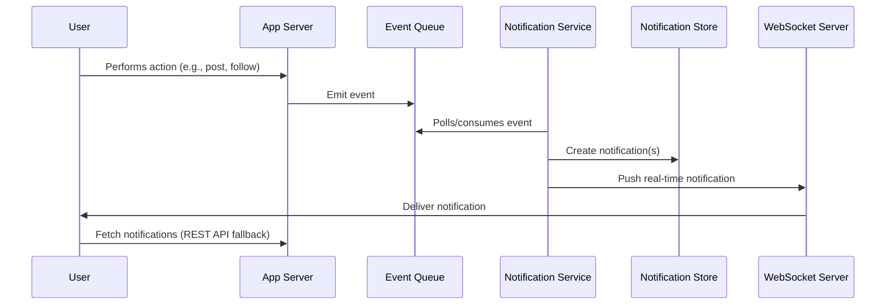

# Insyd Notification System: System Design Document

## 1. Overview

The Insyd Notification System enables real-time and batch notifications for user activities (blogs, chats, jobs, follows, etc.). The system is designed for a bootstrapped startup (100 DAUs) but is architected for easy scaling to 1M DAUs.

---

## 2. Components

### 2.1. Notification Producer
- **Sources:** User actions (posting, commenting, following, etc.)
- **Responsibility:** Emits events when relevant actions occur.

### 2.2. Event Queue (Broker)
- **Tech:** Simple in-memory queue (e.g., Redis, RabbitMQ) for 100 DAUs; Kafka for future scale.
- **Responsibility:** Decouples producers from consumers, buffers events.

### 2.3. Notification Service (Consumer)
- **Responsibility:** Consumes events, determines recipients, creates notification records.
- **Logic:** Deduplication, batching, and user preferences.

### 2.4. Notification Store
- **Tech:** Relational DB (PostgreSQL/MySQL) for 100 DAUs; NoSQL (Cassandra, DynamoDB) for scale.
- **Responsibility:** Stores notification records, read/unread status, user preferences.

### 2.5. Notification Delivery
- **Channels:** In-app (websocket/polling), email (optional), push (future).
- **Tech:** WebSocket server (Socket.IO, etc.) for real-time; REST API for polling.

### 2.6. User Interface
- **Responsibility:** Displays notifications, marks as read/unread, manages preferences.

---

## 3. Flow of Execution

---

## 4. Scale Considerations

- **100 DAUs:** Single instance of each component, in-memory queue, relational DB.
- **1M DAUs:** 
  - Distributed event broker (Kafka)
  - Horizontally scalable notification service
  - Partitioned/replicated notification store
  - CDN for static assets, sharded WebSocket servers

---

## 5. Performance

- **Latency:** Real-time delivery via WebSockets (<1s); batch/email for non-critical.
- **Throughput:** Easily handles 100 DAUs; for 1M DAUs, scale out consumers and brokers.
- **Durability:** Events persisted in queue; notifications stored in DB.

---

## 6. Limitations

- **MVP:** No cross-device sync, no push/email in v1, basic deduplication.
- **Scaling:** In-memory queue and single DB are bottlenecks at high scale.
- **Reliability:** Single points of failure in MVP; add redundancy for scale.

---

## 7. Future Enhancements

- Push/email notifications
- User-configurable notification preferences
- Analytics and notification ranking
- Multi-region deployment

---

**[Copy this to Google Docs/Notion and share the link as your deliverable.]** 